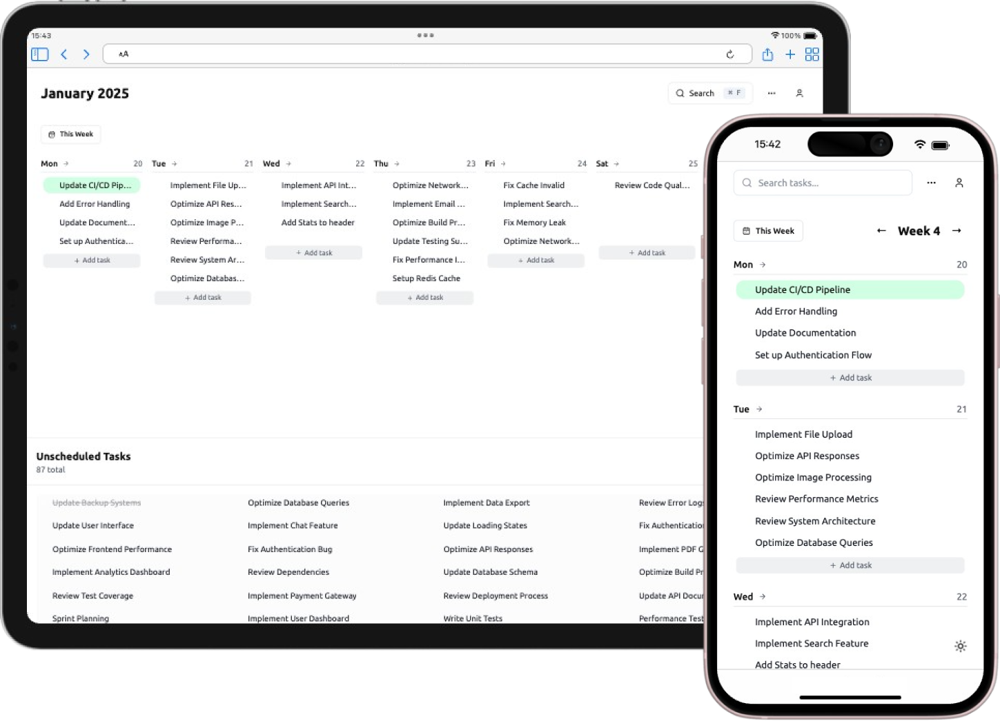

# Eggenda 🍳

Privacy-focused and open-source weekly task agenda with no distractions.

> Inspired by the [Ivy Lee Method](https://en.wikipedia.org/wiki/Ivy_Lee_Method) and [Tweek.so](https://tweek.so) and many other productivity apps.



## Features

### Task Management

- 📅 Weekly grid view with customizable work days
- 📎 Attach any file formats like images, pdfs, etc. to tasks
- 💬 Add comments to tasks for better context
- 🔍 Search through all tasks
- 📱 Mobile-friendly

### Task Organization

- 📋 Drag and drop tasks between days
- 📦 Unscheduled tasks pool
- 🗄️ Archive completed tasks
- 🔄 Move uncompleted tasks to next day
- 📊 Print weekly view

### Save it later features

- 🔗 Automatic URL title fetching for blog posts, articles, etc.
- 🌐 Clickable links in tasks
- 🏷️ URL preview with titles

### Misc

- ⌨️ Keyboard shortcuts (⌘+Enter for new task, ⌘+A for archive)
- 🌓 Dark mode support

## Setup

### Prerequisites

- Node.js 16+
- npm or yarn
- Supabase account

### Supabase Setup

1. Create a new Supabase project at [supabase.com](https://supabase.com)

2. Create the following tables in your Supabase database:

```sql
-- Tasks table
create table tasks (
id uuid default uuid_generate_v4() primary key,
created_at timestamp with time zone default timezone('utc'::text, now()) not null,
updated_at timestamp with time zone default timezone('utc'::text, now()) not null,
title text not null,
description text,
status text default 'todo'::text,
task_date date,
week_number integer,
year integer,
color text,
row_index integer,
user_id uuid references auth.users(id),
attachments jsonb[],
metadata jsonb,
archived_at timestamp with time zone
);
-- Comments table
create table comments (
id uuid default uuid_generate_v4() primary key,
created_at timestamp with time zone default timezone('utc'::text, now()) not null,
updated_at timestamp with time zone default timezone('utc'::text, now()) not null,
task_id uuid references tasks(id) on delete cascade,
user_id uuid references auth.users(id),
content text not null
);
-- Enable Row Level Security
alter table tasks enable row level security;
alter table comments enable row level security;
-- Create policies
create policy "Users can view their own tasks"
on tasks for select
using (auth.uid() = user_id);
create policy "Users can insert their own tasks"
on tasks for insert
with check (auth.uid() = user_id);
create policy "Users can update their own tasks"
on tasks for update
using (auth.uid() = user_id);
create policy "Users can delete their own tasks"
on tasks for delete
using (auth.uid() = user_id);
-- Similar policies for comments
create policy "Users can view comments on their tasks"
on comments for select
using (auth.uid() in (
select user_id from tasks where id = task_id
));
create policy "Users can insert comments on their tasks"
on comments for insert
with check (auth.uid() in (
select user_id from tasks where id = task_id
));

-- User Settings table
create table public.user_settings (
  id uuid default uuid_generate_v4() primary key,
  user_id uuid references auth.users(id) on delete cascade not null,
  theme text default 'system',
  email_notifications boolean default true,
  created_at timestamp with time zone default timezone('utc'::text, now()) not null,
  updated_at timestamp with time zone default timezone('utc'::text, now()) not null,
  unique(user_id)
);

-- RLS (Row Level Security) politikaları
alter table public.user_settings enable row level security;

create policy "Users can view their own settings"
  on public.user_settings for select
  using (auth.uid() = user_id);

create policy "Users can update their own settings"
  on public.user_settings for update
  using (auth.uid() = user_id);

create policy "Users can insert their own settings"
  on public.user_settings for insert
  with check (auth.uid() = user_id);
```

3. Set up storage buckets:

   - Create a new bucket called `task_attachments`
   - Set up appropriate policies for file access

4. Create a `.env.local` file with your Supabase credentials:

```
NEXT_PUBLIC_SUPABASE_URL=
NEXT_PUBLIC_SUPABASE_ANON_KEY=
```

4. Open [http://localhost:3000](http://localhost:3000) in your browser

## Keyboard Shortcuts

- `⌘/Ctrl + Enter` - Create new task for today
- `⌘/Ctrl + A` - Archive current task (in task detail view)

### PWA Support

The app supports installation as a Progressive Web App (PWA) on both desktop and mobile devices:

#### iOS Installation
1. Open the app in Safari
2. Tap the Share button
3. Scroll down and tap "Add to Home Screen"
4. Give the app a name (default: Eggenda)
5. Tap "Add"

#### Android Installation
1. Open the app in Chrome
2. Tap the menu (three dots)
3. Tap "Install app" or "Add to Home screen"
4. Follow the prompts

#### Desktop Installation
1. Open the app in Chrome, Edge, or other supported browser
2. Look for the install icon in the address bar
3. Click "Install" when prompted

## Contributing

Contributions are welcome! Please feel free to submit a Pull Request.

## License

MIT License - feel free to use this project for personal or commercial purposes.
